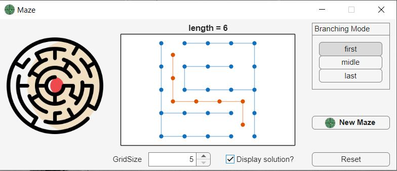

# Lab-Maze Generator

Αυτή είναι μια αυτόνομη εφαρμογή Windows που δημιουργεί τυχαίους λαβύρινθους και επιτρέπει την οπτικοποίηση της επίλυσής τους.

## Πώς να το χρησιμοποιήσετε
1. Μεταβείτε στον φάκελο `release\build\`.
2. Εκτελέστε το αρχείο **`maze.exe`**.
3. Στο παράθυρο που θα ανοίξει:
    * Επιλέξτε το μέγεθος του πλέγματος (**GridSize**).
    * Επιλέξτε τη λειτουργία διακλάδωσης (**Branching Mode**):
        * **first**: Δημιουργία με βάση το πρώτο διαθέσιμο μονοπάτι.
        * **middle**: Δημιουργία με βάση το μεσαίο μονοπάτι (πιο ισορροπημένη δομή).
        * **last**: Δημιουργία με βάση το τελευταίο διαθέσιμο μονοπάτι.
    * Πατήστε το κουμπί **"New Maze"** για παραγωγή.
    * Ενεργοποιήστε το πλαίσιο **"Display solution?"** για να δείτε τη συντομότερη διαδρομή.

## Στιγμιότυπο της Εφαρμογής

## Τεχνικές Πληροφορίες
Η εφαρμογή βασίζεται σε αλγόριθμους θεωρίας γραφημάτων για τη δημιουργία λαβυρίνθων:
* **Δομή**: Χρήση διακριτής Λαπλασιανής για τον καθορισμό των τοιχωμάτων.
* **Αλγόριθμος**: Χρησιμοποιείται αναζήτηση κατά βάθος (DFS) για την κατασκευή του δέντρου των μονοπατιών.
* **Επίλυση**: Η συντομότερη διαδρομή υπολογίζεται με τη συνάρτηση `shortestpath`.

## Πνευματικά Δικαιώματα
Βασίζεται στον κώδικα των: Copyright 2019 Cleve Moler, The MathWorks, Inc.	